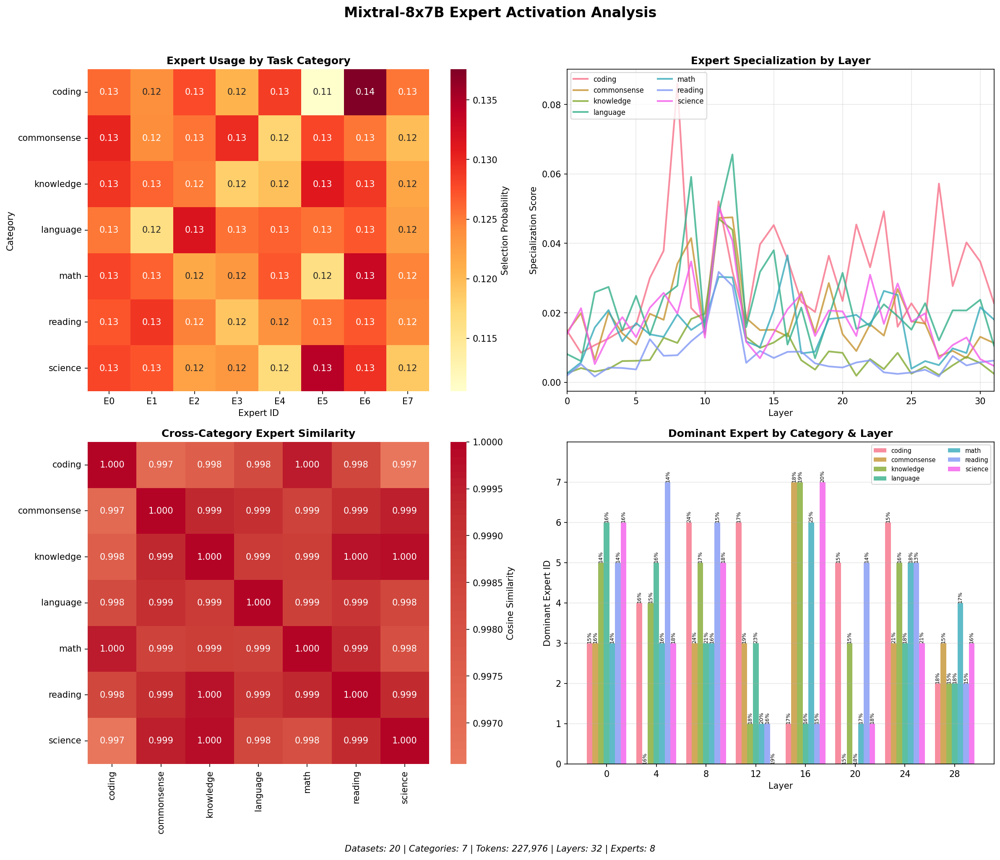
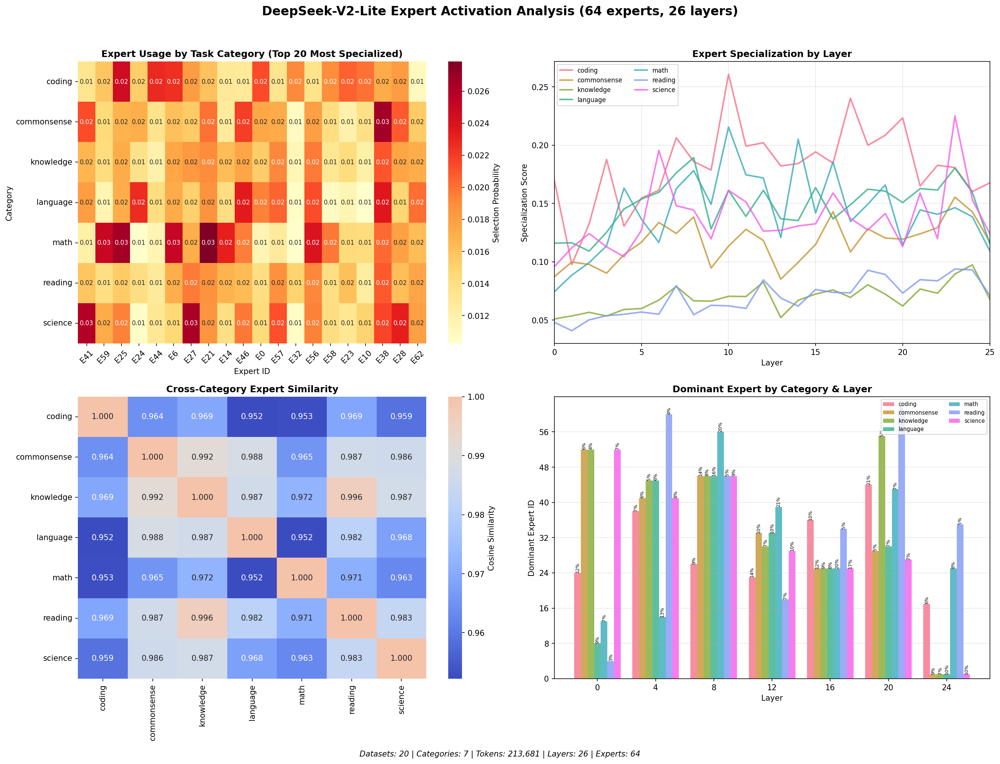

# Rethinking Mixture of Experts through Sparse Coding and Competitive Learning

## 1. Introduction

Mixture of Experts (MoE) layers have become the dominant paradigm for decoupling parameter count
from compute in large transformer models. The core idea is simple: to reduce inference latency, we
have to do less work per token. In an autoregressive model, that means spending fewer FLOPs on each
next-token prediction by selectively activating only part of the network. In MoEs, an *expert* is
the unit of compute we toggle on and off.

A common framing of MoEs is one of dynamic conditional
computation: we have a collection of experts, each an MLP, and we conditionally gate their outputs
based on a lightweight router. From that perspective, functional specialization emerges from the
router's partitioning of the input data manifold. Empirically, this can recover much of the quality
of a dense model while using far less compute per token.

For all the [optimization](./moe.md) required to make MoEs train and scale, routing itself is often
just a single linear projection from the token’s hidden state into $m$ **routing scores** (one per
expert), followed by a softmax and a Top‑$k$ selection. The details vary (token-level routing,
per-head routing, shared experts, etc.), but most open-source MoE architectures follow this basic
softmax + Top‑$k$ pattern.

This article assumes you're familiar with traditional [MoE basics](https://newsletter.maartengrootendorst.com/p/a-visual-guide-to-mixture-of-experts) so we can focus on failure modes and alternative ways to think about sparsity. This is the first part in a two-part sequence: here we build a lens and situate recent work; next we get more concrete.

## 2. Limitations of MoEs

The classic issues encountered with MoEs are:

* Under-specialization (several experts learning the same thing) 
* Dead experts (some experts never getting selected by the router)
* Load imbalance (some experts activating far more frequently than others)


As a simplifying thought experiment, imagine “lakes” (regions of the data manifold) with different
amounts of “fish” (training signal), and “fishermen” (experts) that can only fish where they’re
routed. With 2 lakes containing 10 and 4 fish and 2 fishermen, sending both to the 10‑fish lake is
globally suboptimal (10 vs 14), but locally stable: neither fisherman has an incentive (gradient) to
move to the uncovered lake. A poorly initialized fisherman in an empty lake starves
(<span class="idea">zero gradient flow from hard top-k gating</span>), while a fisherman who finds a
huge lake gets disproportionately rich
(<span class="idea">without any redistributive mechanism</span>).

These all stem from the Top‑$k$ filter that we apply to routing scores. The selection itself is a
hard, non‑differentiable operation: during the forward pass we pick the *currently* highest‑scoring
experts, and during backprop we only send gradient through the experts that were chosen. In standard
implementations, there’s no gradient through the *identity* of who would have been selected if the
scores changed slightly. Depending on how we randomly 
initialize their default weights, it's 
possible some experts will never activate at 
all (dead experts). Or some will always 
concurrently activate for the same input 
(under-specialization). Or there will 
be a fixed bias towards some over 
others because of where actual encoded data 
falls in the hidden space manifold (load 
imbalance).

Our goal in this work is to rethink the MoE setup from the perspective of sparse representations,
specifically leveraging principles from [sparse coding](http://ufldl.stanford.edu/tutorial/unsupervised/SparseCoding/) and [competitive learning](https://labs.seas.wustl.edu/bme/raman/Lectures/Lecture10_CompetitiveLearning.pdf).
Some particular frames we will develop include:

* Each expert in an MoE performs a low-rank read and a low-rank write, and selected experts interact additively, much like attention heads (assuming the expert width is smaller than the residual stream dimension).
* Removing Top‑$k$ filters does not automatically encourage experts to **compete** to explain an input.
* Ultimately, what we're doing is learning a decomposition of the data manifold into combinations of
low dimensional subspaces.

This lens connects MoEs to classical sparse coding, competitive learning, and compressed sensing,
and suggests a set of design principles not visible if we think of MoEs purely as a form of
conditional computation.

We'll spell out this mental model more concretely in Section 2, and connect it to some classical
work. In Section 3, we'll situate some recent papers along these themes within the frames we've
developed.

### 2.1. Measuring Limitations

Most papers only publish cursory analysis on the routing behavior of their MoE head. With access to the full inference weights, however, it's possible to measure how they route given different inputs to see if there are common trends.

#### Methodology

To make “expert specialization” concrete, we log **which experts get selected** by the router during inference and then aggregate those selections by **task category** and **layer**. Let's take Mixtral as one representative model here.

Concretely, for each input in a category:

* We run the model and record, for every token and every MoE layer, the **Top‑2 expert indices** selected by the router (Mixtral has 8 experts per MoE layer).
* We treat each Top‑2 selection as an event. For expert $i$, layer $\ell$, and category $c$, we estimate:

```
p_{i,ℓ,c} = (# times expert i is selected among the Top-2 at layer ℓ for category c)
            / (2 × # tokens routed through layer ℓ for category c)
```

This gives an 8‑way probability distribution per (layer, category). The plots below are different views of the same object: **how the routing distribution changes (or doesn’t) across categories and depth**.

We sample 100 datapoints from each dataset and let the models run until they naturally terminate. To motivate the below discussion, we use this evaluation as a grounding focus.



#### Panel 1: Expert Usage by Task Category

A heatmap showing how often each expert gets selected per category.

**What it measures:** When Mixtral processes each token, its router picks the **top-2 experts** (out of 8) to handle that token. This panel shows the selection probability for each expert.

**How to read it:**

* Each cell shows $P(\text{expert selected} \mid \text{category})$
* Uniform baseline would be **12.5%** (1/8 experts)
* Warmer colors = higher selection probability

**Mixtral:** Nearly uniform distribution (roughly 11-14% range). If experts were task-specialized, we'd see patterns like "math → Expert 3 at 40%, others at 8%".

---

#### Panel 2: Expert Specialization by Layer

Line plot showing specialization scores across the 32 transformer layers.

**What it measures:** How "concentrated" expert selection is at each layer, computed using entropy:

$specialization = 1 - (entropy / max\_entropy)$

where entropy = $-Σ p(i) × log₂(p(i))$ and max_entropy = $log₂(8) = 3 bits$

**Interpretation:**

* **1.0** = One expert always chosen (maximum specialization)
* **0.0** = All 8 experts equally likely (no specialization)

**Mixtral:** Scores of roughly 0.01-0.08 indicate nearly uniform selection. Layers 11-12 show slight peaks, suggesting mid-network layers have marginally more concentrated routing.

---

#### Panel 3: Cross-Category Expert Similarity

Heatmap showing cosine similarity between categories' expert usage patterns.

**What it measures:** Whether different task types route tokens to experts differently.

**The vectors being compared:**

For each category, we build an 8-element vector of expert selection probabilities:

```
math   = [P(E0), P(E1), P(E2), P(E3), P(E4), P(E5), P(E6), P(E7)]
       = [0.13,  0.13,  0.12,  0.13,  0.12,  0.12,  0.13,  0.12]

coding = [0.13,  0.12,  0.13,  0.12,  0.13,  0.11,  0.14,  0.13]
```

**Cosine similarity** measures the angle between these vectors in 8-dimensional space:

```
cos(θ) = (A · B) / (|A| × |B|)
```

* **1.0** → Vectors point same direction (identical expert preferences)
* **0.0** → Vectors perpendicular (uncorrelated preferences)

**Mixtral:** All similarities >0.997, meaning the vectors are essentially parallel. Categories route tokens to experts in nearly identical proportions.

---

#### Panel 4: Dominant Expert by Category & Layer

Bar chart showing which expert is most frequently selected at each layer, broken down by category.

**What it measures:** The "winning" expert at sampled layers (0, 4, 8, 12, ..., 28), with selection percentage annotated.

**Mixtral:** Some layer-specific “winners” exist (e.g., layer 12 often prefers a particular expert), but margins are small (often ~13-17%), and no category strongly deviates from others.

#### DeepSeek-V2 Lite



In contrast to Mixtral, DeepSeek-V2 Lite shows more meaningful expert specialization across task definitions.

* **More structure than Mixtral:** Averaged over layers, the “top specialized” experts sit around ~1-3% selection probability (vs a 64-expert uniform baseline of \(1/64 \approx 1.6\%\)), indicating meaningful deviations from uniform routing.
* **Stronger (and category-dependent) specialization across depth:** Entropy-based specialization is much larger (often ~0.10–0.25), with categories separating noticeably (e.g., coding/math higher than reading/commonsense in many layers).

## 3. Core Frames

### 3.1 From Dense MLPs to Expert Dictionaries

Consider a standard transformer block with residual stream dimension $D$. A dense MLP layer is a map

$x \in \mathbb{R}^D \quad \mapsto \quad x + U f(V^\top x)$

where $V \in \mathbb{R}^{D \times D_2}$ is the “read” matrix, $U \in \mathbb{R}^{D \times D_2}$
is the “write” matrix, $D_2$ is the hidden width, and $f$ is some nonlinearity.

An MoE layer does not fundamentally change this picture. It just **partitions** the hidden dimension into blocks that we call experts.

Let

* $m$ = number of experts
* $b$ = width of each expert
* $k$ = number of active experts
* $D_2 = m b$ = total hidden width

We can think of the hidden dimension as $m$ contiguous chunks (experts) of size $b$. We'll work in
the setting where $b << D$, i.e. "narrow" or "fine-grained" experts. We'll later see why this makes
sense both computationally and from a modeling perspective.

Expert $i$ corresponds to:

* a read submatrix $V_i \in \mathbb{R}^{D \times b}$
* a write submatrix $U_i \in \mathbb{R}^{D \times b}$

If $S \subseteq \{1, \dots, m\}$ is the set of active experts for a given token, the layer implements

$x \quad \mapsto \quad x + \sum_{i \in S} U_i f(V_i^\top x)$

If we freeze the set $S$, this is just a **sum of low rank updates**. Each expert performs

$\mathbb{R}^D \xrightarrow{\text{read } V_i^\top} \mathbb{R}^b \xrightarrow{f} \mathbb{R}^b \xrightarrow{\text{write } U_i} \mathbb{R}^D$,

and these contributions add to the residual stream.

Standard routing forms the full update by weighting the writes of selected experts by the router
weights p(x):

$x \quad \mapsto \quad x + \sum_{i \in S} p_i(x)\, U_i f(V_i^\top x)$

In our view, this standard approach to routing ignores the semantics of the "low rank read + write"
view, which is our preferred primitive. In particular, with low rank readers, each expert only
"sees" a $b$ dimensional subspace of the input space. This view allows us to move beyond asking
"how do we route tokens?" and instead:

1. Expert specialization becomes a question of how to efficiently/non-redundantly tile the
input data manifold into low dimensional subspaces

2. Expert selection becomes a question of selecting a sparse subset of experts
whose read subspaces can jointly encode the given high dimensional input

Both of these problems are intimately related to the classical problems of dictionary learning and
sparse coding (TODO - links).

### 3.2 Intuition: Low Rank Reads and Energy Capture
One analogy to illuminate the energy capture view is to imagine a 3D object in a room behind a
screen. You cannot see the object directly, and only see the shadows cast on the screen by different
lights. In this analogy:

* The object represents the true, high dimensional state of the residual stream $x$.
* Each light corresponds to a low rank read matrix $V_i$.
* The shadow on the screen is the hidden representation $h_i = V_i^\top x$.

Depending on the angle and position of a light, its shadow can either squash the object into an uninformative blob, or preserve enough structure to recognize it. We can judge the effectiveness of
a particular light for this object by how much structure it preserves.

In our setting, expert $i$ “sees” the input only through $h_i = V_i^\top x$. If $\lVert h_i\rVert_2^2$ is small, that expert is effectively blind to this token. If $\lVert h_i\rVert_2^2$ is large, the expert is capturing a big chunk of the **energy** of $x$ along the directions it cares about.

This suggests a natural routing rule:

For a given token, pick the experts that capture the most energy in their reads.
More precisely, pick the top‑$k$ experts by $\lVert V_i^\top x\rVert_2^2$.

Instead of a separate router network, we can directly select experts based on their relevance to the
input, as measured by the size of their read, which is the alignment between their read subspace and
the input vector.

This is related to the intuition behind several classical algorithms, including k-means, PCA, and
competitive learning:

* In the $b = 1$ limit, each expert's read matrix reduces to a single vector $v_i$.
* In Principal Components Analysis, we judge each principal
* In k-means, centroids compete for ownership of a data point, and each centroid moves to better represent the points it wins.
* Here, each expert is a low dimensional subspace rather than a single vector, and experts compete
to capture energy from points in different regions of the manifold.


### 3.3 Geometry of reads: incoherence and compressed sensing

For the energy-capture competition setup to work, we need to address a couple natural failure modes.

First, each expert can increase $\lVert V_i^\top x\rVert_2$ by simply scaling its weights. We can
fix this by constraining (or regularizing) the columns of $V$ to have controlled norm.

A slightly more subtle point is that experts can “cheat” by all pointing in the same high variance directions.

* Within an expert: each column of $V_i$ can try to align with the top principal component of the data.
* Across experts: different $V_i$ can duplicate each other.

That would maximize $\lVert V_i^\top x\rVert_2^2$ for many tokens, but it defeats the point: you
end up with many copies of the same expert, not a diverse dictionary.

The considerations here are quite similar to those in Principal Components Analysis: in order for
each subsequent principal component to meaningfully capture new information, each component is
constrained to be orthogonal to previous ones, and unit norm. In our setting, perfect orthogonality
among the columns of $V$ is not possible, since $V$ has more columns than dimensions. However,


## 4. How existing work fits into the sparse coding / competition lens

A lot of recent MoE work touches pieces of this story:

* competition between experts
* expert diversity and orthogonality
* representation collapse in routing
* sparse coding for interpretability

Most of it, however, treats these as isolated knobs rather than as consequences of a single geometric picture. In this section we situate a few representative papers inside the sparse coding / competitive learning lens described above, and highlight what they do, what they miss, and how they inform our direction.

We'll discuss the following papers:

* *Sparse Mixture of Experts as Unified Competitive Learning* (USMoE)
* *TopK Language Models*
* *OMoE: Orthogonal Mixture of Experts*
* Work on representation collapse in SMoEs
* *Monet: Mixture of Monosemantic Experts for Transformers*
* *CompeteSMoE*

### 4.1 USMoE: a competition-flavored routing knob

USMoE starts from an observation that is broadly aligned with the competitive learning lens:

* **Token choice** routing (selecting experts independently for each token) can over-focus on “irrelevant” experts for certain tasks (they emphasize text embeddings / MTEB).
* **Expert choice** routing (allocating tokens to experts in a more global fashion) can discard important tokens.

They frame these as two competitive learning regimes and propose a “unified competitive learning” scheme that interpolates between them by taking a **convex combination** of token-choice and expert-choice scores.

From the sparse coding viewpoint:

* USMoE stays in the **router-centric regime**. There is still a separate scoring network that operates in a low dimensional routing space.
* Competition is defined over router scores, not over the actual energy captured by experts in the residual stream.
* There is no explicit notion of expert geometry or dictionary conditioning.

So USMoE is useful as a diagnostic: it backs up the idea that competitive behavior of experts matters for generalization, especially off the autoregressive training path. But algorithmically, it is a **routing knob**, not a rethink of what the experts are or how they interact with the residual stream.

For our purposes, it is a reminder that downstream tasks like embeddings are sensitive to subtle routing pathologies. It does not directly tell us how to design a better set of experts.

### 4.2 TopK LMs: hard sparsity baked into the architecture

TopK Language Models take a different tack. Instead of post-hoc sparse autoencoders (SAEs), they modify the transformer architecture so that certain hidden layers apply a **TopK activation**, turning the hidden state itself into the latent code of an SAE.

Conceptually:

* The read matrix (V) is the incoming projection into the hidden layer.
* A hard TopK nonlinearity enforces sparsity in the hidden activations.
* The write matrix (U) maps these sparse codes back to the residual stream.

This is almost the simplest possible way to bake sparse coding into the forward pass. It shares some motivations with our setup:

* Fine grained sparsity
* Aligning model internals with a feature basis that is interpretable and steerable
* Avoiding the ambiguity of post-hoc SAEs

However, from a competitive learning and geometry perspective, TopK LMs largely stop at “TopK exists”:

* There is no structured blocking of the dictionary into experts.
* There is no explicit competition story beyond “be in the top k activations.”
* There is no attempt to encourage approximate orthogonality, diversity, or non-redundancy among dictionary atoms, beyond whatever emerges from the task loss.

This makes TopK LMs a great **baseline** and sanity check. They show that you can make activations sparse without immediately tanking performance, and that doing so helps interpretability. They do not yet exploit the full space of ideas around energy-based competition and expert geometry.

### 4.3 OMoE: orthogonalizing writes to fight redundancy

OMoE is motivated by a problem that is front and center in the sparse coding view: **expert homogeneity**. They point out that in many MoE models, expert representations end up highly similar, with some layers showing up to 99 percent similarity between experts.

Their fix is to introduce an **orthogonal expert optimizer** that, for each input, orthogonalizes the **writes** of the active experts. Roughly:

* Given the per-expert outputs, they apply a Gram–Schmidt-like procedure so that later experts contribute only the components of their output that are not already spanned by earlier experts.
* This implicitly penalizes redundant experts, since redundant directions get projected away and receive less gradient signal.

The grocery-shopping analogy is helpful here:

> You send multiple shoppers to buy groceries. When they return, you unpack them one by one. For each shopper, you keep only the items that nobody has bought yet and throw away duplicates.
> Shoppers who keep buying bananas after others already did will have most of their contribution discarded. Over time they learn to specialize in other parts of the shopping list.

In the MoE context:

* The “shopping list” is the residual stream update.
* Experts whose writes lie in already-covered directions get their contributions projected out and starve of gradient.
* This encourages diversity in what experts write back, without ever touching the read side.

From our sparse coding lens, OMoE is interesting but asymmetric:

* It operates entirely on **activations**, not on weights.
* It attacks redundancy in **writes**, whereas our focus is primarily on the **read geometry** and weight-level incoherence.
* It enforces a strict, input-dependent orthogonalization that may throw away useful signal, rather than asking for approximate orthogonality in the learned dictionary itself.

So OMoE provides evidence that explicitly encouraging diversity among experts is useful and trainable. It also suggests a complementary axis to ours: we focus on making reads well conditioned and diverse, they focus on orthogonalizing writes at run time. A more unified picture would reason jointly about both.

### 4.4 Representation collapse in SMoEs: routing geometry as a failure mode

Work on representation collapse in sparse MoEs starts from another pathology that becomes obvious once you look at routing through a geometric lens:

* Standard router architectures often map residual states into a smaller routing space and then learn centroids or prototypes in that space.
* Tokens get routed based on proximity to these centroids.
* Over training, token representations are implicitly encouraged to **cluster around combinations of expert centroids**, reducing diversity in the original feature space.

This is a form of collapse: the model learns to organize its internal representation around a small number of routing prototypes, which is not obviously aligned with the true structure of the task.

One line of work addresses this by **estimating routing scores on a low dimensional hypersphere**. Informally:

* Do the clustering and competition in a reduced space where collapse is “allowed.”
* Try to preserve flexibility and variation in the original residual stream.

Within our sparse coding framing, this is a partial fix. It accepts the basic router-centric setup and tries to avoid its worst geometric side effects by modifying the router space.

In contrast, if we route based on **read energy** (|V_i^\top x|_2^2) directly:

* The “centroids” are literally the columns of (V), not separate router embeddings.
* Tokens are encouraged to cluster around directions in the read dictionary.
* If that dictionary is well conditioned and incoherent, clustering is exactly what we want: it means different experts are truly specializing to different slices of the manifold.

So representation collapse papers are valuable in that they sharpen the diagnosis: naive routing geometries can distort the internal representation in harmful ways. Our approach tries to sidestep this by making the **dictionary itself** the geometry that routing is based on, and by shaping that dictionary to have good properties.

### 4.5 Monet: scaling expert count via product keys

Monet pursues a different axis: extremely large expert counts and mechanistic interpretability.

They combine:

* a product key style addressing scheme that lets them scale the number of experts to $262{,}144$ per layer while keeping parameter growth roughly proportional to $\sqrt{\text{num experts}}$, and
* a sparse dictionary learning objective embedded directly into the MoE, with the goal of learning monosemantic experts whose knowledge can be individually inspected and edited.

Motivationally this is close to our direction:

* Experts are treated as carriers of specific “knowledge slices.”
* There is a desire for mutual exclusivity of experts and explicit manipulation of domains, languages, and toxicity.

However, algorithmically the emphasis is on **indexing and scale**:

* Product keys give a clever way to address many experts efficiently.
* There is less focus on the fine geometry of the reads and writes, or on maintaining RIP-like properties of the dictionary.
* Diversity is encouraged mostly by sheer number of experts and specialization pressure, rather than by explicit incoherence constraints.

From the sparse coding perspective, Monet is a “brute force” point in the design space: crank up expert count and add some sparse learning structure, without deeply shaping the underlying geometry. It shows that expert granularity and interpretability can be improved dramatically. It leaves open how much additional benefit we can get by being more deliberate about the dictionary itself.

### 4.6 CompeteSMoE: approximating competition with a router

CompeteSMoE is probably the closest in spirit to the **energy-based competition** story.

At a high level:

* They define a competition score for each expert based on its **activation norm**. In their notation, something like $s_i = \lVert g(z, W_{e_i})\rVert^2$, which is very similar to our notion of expert “energy.”
* Ideally, they would route by actually computing all expert activations and then selecting experts with highest scores.
* This is computationally expensive, so they train a **router** to predict the competition outcome and use that instead.

In other words:

1. Define a conceptually clean but expensive competition rule (pick experts with high activation energy).
2. Distill this rule into a cheaper scoring function.
3. Use the distilled router at scale.

A reasonable way to read this is as an engineering compromise: if you believe energy-based
competition is the right signal but don't have a better handle on efficiency, you can train a router to
approximate it. From our viewpoint, a few points stand out:

* Their “energy” is defined over the **full expert output**, combining read and write. We are more interested in energy on the **read side** (V_i^\top x), for both geometric and interpretability reasons.
* They **do not shape** the geometry of expert reads or writes. There is no coherence penalty, no RIP-like constraints, no explicit attempt to prevent cheating.
* They do not fully resolve the computational question. They sidestep it by introducing a router that approximates the competition distribution.

This puts CompeteSMoE in an interesting position in the design space:

* It reinforces that competition based on activation magnitude is a useful signal.
* It hints at a “teacher router” pattern where competition is used to supervise a cheaper routing function.
* It does not yet connect that competition to a principled sparse coding geometry.

One of the open questions for our direction is whether we want a similar two-stage story (competition during training, router at inference) or whether we can make the energy-based routing itself efficient enough to be the primary mechanism.
